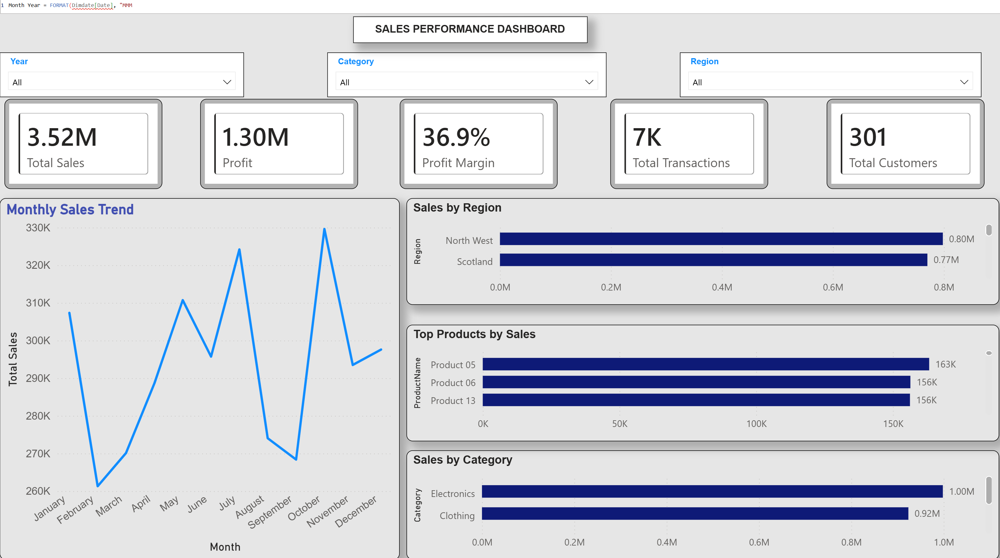

# Sales Performance & Profitability Dashboard

## Project Overview

This project presents an interactive Power BI dashboard designed to analyse sales performance, profitability, customer activity, product performance, and regional trends.

The project covers the complete BI workflow from cleaning and transforming raw data in Power Query to data modelling, DAX calculations, dashboard development, and business insight generation.

## Dashboard

## Business Objective

The objective of this project was to transform raw sales, customer, and product data into an interactive reporting solution that allows stakeholders to:

- Monitor overall sales and profitability
- Track monthly sales trends
- Compare regional performance
- Identify top-performing products and categories
- Analyse customer and transaction activity
- Filter performance dynamically by year, category, and region

## Key KPIs

- Total Sales: £3.52M
- Profit: £1.30M
- Profit Margin: 36.9%
- Transactions: ~7K
- Customers: 301

## Data Preparation

Power Query was used to clean and transform the source data before analysis.

Key transformations included:

- Correcting data types
- Handling missing and invalid values
- Removing duplicate records
- Standardising inconsistent Customer IDs
- Resolving unmatched customer records
- Cleaning categorical and text fields
- Preparing sales, customer, and product tables for modelling

One key data-quality issue involved inconsistent Customer ID formats between the sales and customer datasets. This caused transactions to fail to match customer records and resulted in blank geographic reporting. The identifiers were standardised in Power Query and the relationships were validated after transformation.

## Data Modelling

A dimensional modelling approach was used with the sales transaction table acting as the fact table and customer, product, and date data providing analytical dimensions.

Many-to-one relationships and single-direction filtering were used to support reliable analysis across the model.

## DAX & Analysis

DAX measures were created for key business metrics including:

- Total Sales
- Profit
- Profit Margin
- Total Transactions
- Total Customers

The measures respond dynamically to report filter context, allowing users to analyse performance across different time periods, categories, and regions.

## Dashboard Features

The dashboard includes:

- KPI cards for Sales, Profit, Profit Margin, Transactions, and Customers
- Monthly sales trend analysis
- Sales by region
- Top products by sales
- Sales by category
- Interactive Year, Category, and Region slicers

## Key Insights

- The business generated £3.52M in total sales and £1.30M in profit, with a 36.9% profit margin.
- October recorded the strongest monthly sales performance at approximately £326K.
- North West was the highest-performing region at approximately £0.80M in sales.
- Electronics was the strongest category, generating approximately £1.0M in sales.
- Product 05 was the highest-performing individual product at approximately £163K in sales.

## Tools & Skills

- Power BI
- Power Query
- DAX
- Data Cleaning
- Data Transformation
- Data Modelling
- Data Visualisation
- Business Intelligence
- KPI Reporting
- Business Analysis
